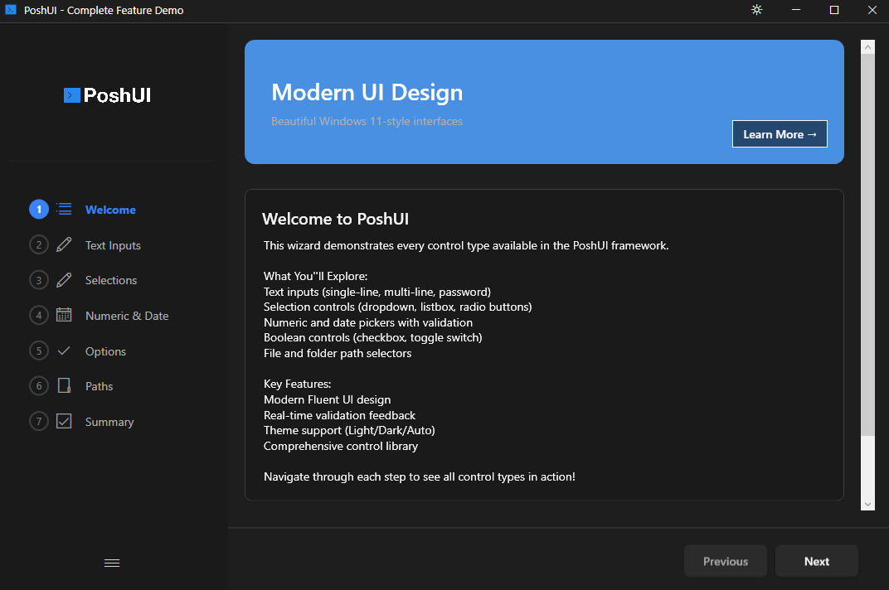

# About

Build beautiful PowerShell wizards, dashboards, and workflows—the PowerShell way.

PoshUI enables IT professionals to create professional Windows 11-style interfaces using familiar PowerShell cmdlets—**no WPF, XAML, or C# knowledge required**.

## Three Independent Modules

PoshUI consists of three independent modules that can be used separately:

### PoshUI.Wizard

Create step-by-step guided interfaces for configuration, deployment, and setup workflows. Perfect for server provisioning, VM creation, and application deployment.

- [Step-by-Step Navigation](./wizards/steps.md)
- [12+ Built-in Controls](./controls/about.md)
- [Live Execution Console](./wizards/execution.md)
- [Branding & Customization](./wizards/branding.md)
- [Dynamic Data Sources](./controls/dynamic-controls.md)
- [Input Validation & Error Handling](./platform/validation.md)

### PoshUI.Dashboard

Build card-based monitoring interfaces with metrics, charts, and interactive tools. Perfect for system monitoring, KPI displays, IT operations centers, and sharing tools with your team.

- [MetricCards](./visualization/metric-cards.md) - Display KPIs and system metrics
- [GraphCards (Bar, Line, Area, Pie)](./visualization/graph-cards.md) - Visualize trends and data
- [DataGridCards](./visualization/datagrid-cards.md) - Show tabular data
- [ScriptCards](./visualization/script-cards.md) - Turn scripts into clickable tools for end users
- [Category Filtering](./dashboards/categories.md) - Organize cards into filterable groups
- [Real-time Data Updates](./dashboards/refresh.md) - Auto-refresh cards with live PowerShell execution

**ScriptCards** empower end users to run PowerShell scripts with a single click:

### PoshUI.Workflow

Orchestrate multi-step automated processes with progress tracking, approval gates, and reboot/resume capabilities. Perfect for server deployments, software installations, and maintenance tasks.

- [Task-Based Execution](./workflows/tasks.md)
- [Progress Tracking](./workflows/progress-reporting.md)
- [Approval Gates](./workflows/about.md)
- [Reboot & Resume](./workflows/reboot-resume.md)
- [Data Passing Between Tasks](./workflows/data-passing.md)
- [Workflow Logging](./workflows/logging.md)

## Platform

Built on .NET Framework 4.8 with a hybrid architecture combining PowerShell flexibility with WPF rendering power.

- [Windows PowerShell 5.1 Support](./system-requirements.md)
- [Windows 10/11 & Server 2016+](./system-requirements.md)
- [Light/Dark Theme Support](./platform/theming.md)
- [CMTrace-Compatible Logging](./platform/logging.md)
- [No External Dependencies](./installation.md)

## Community

Join the PoshUI community and contribute to the project.

- [GitHub Repository](https://github.com/asolutionit/PoshUI)
- [Issue Tracker](https://github.com/asolutionit/PoshUI/issues)
- [Discussions](https://github.com/asolutionit/PoshUI/discussions)

## Licensing

PoshUI is open source under the MIT License.

[View License](./licensing.md)
